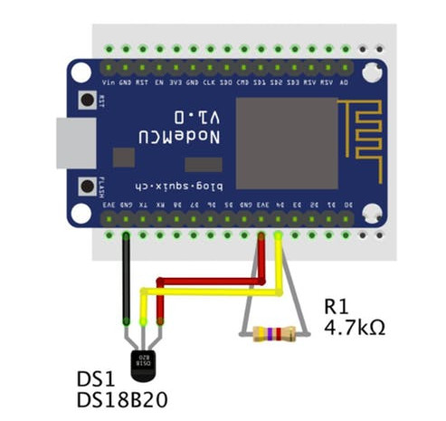
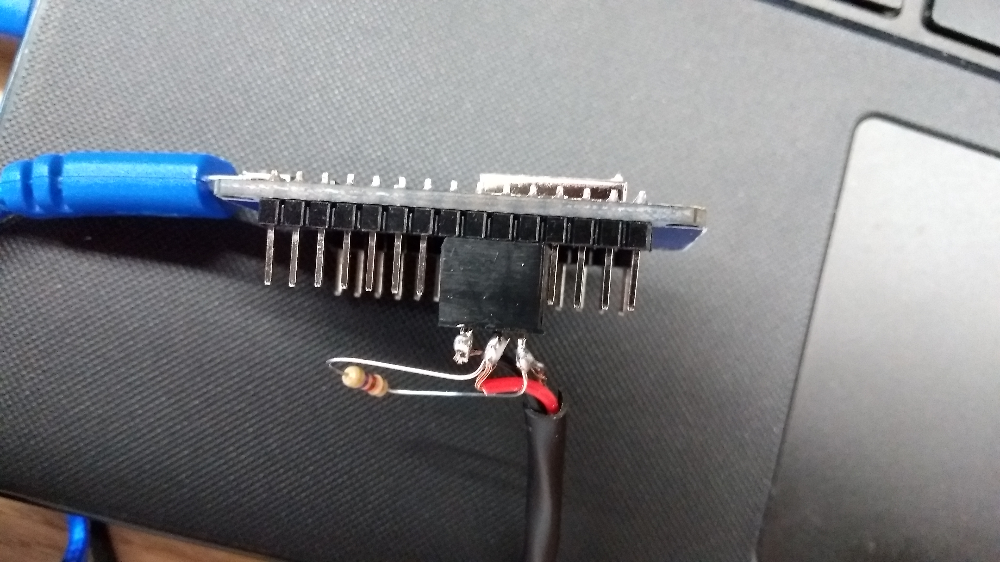
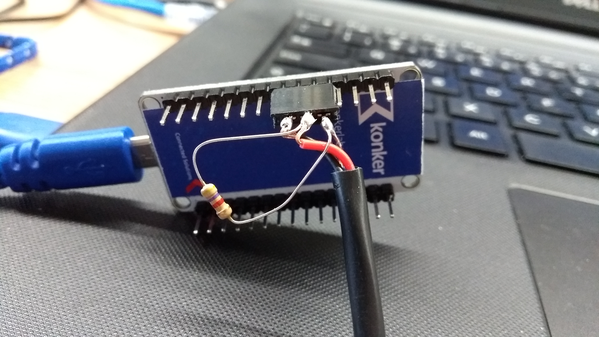

__Temperature Sensor Example__

What you need?
 - Arduino IDE
 - A esp8266 (Nodemcu)
 - Nodemcu lib
 - PubSubClient lib
 - DallasTemperature lib
 - Onewire lib
 - ArduinoJson lib

1 - Install dependencies:

  - In your Arduino IDE go to Tools->Board->Board Manager
    - Fin by Nodemcu or Esp8266 and click on Install
  - In your Arduinl IDE go to Sketch->Include Libraty->Manage Libraries
    - Find by ArduinoJson and click on Install
    - Find by DallasTemperature lib and click on Install
    - Find by PubSubClient lib and click on Install

2 - Mount thing
 Bellow is the sketch for this example:
   

 You would use a protoboard or also sold components like:
   
   

3 - Open firmware.ino file in your ArduinoIDE
4 - Click on Upload Button and open the Serial Monitor by pressing Tools->Serial Monitor
  4.1 - Change baud to 9600

5 - When the upload is done, you should see the some logs about startup, connection and messages sended in Serial monitor

